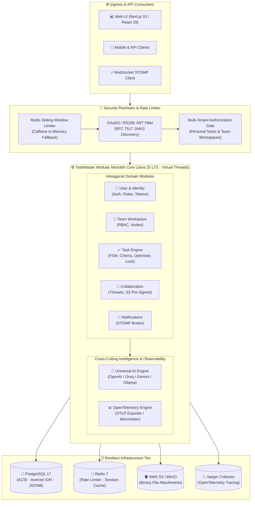

<div align="center">

# TaskMaster

### Distributed Collaborative Task Platform

[](https://github.com/shashankch/task-master/actions/workflows/ci.yml)
[-f89820?style=flat-square&logo=openjdk&logoColor=white)](https://openjdk.org/projects/jdk/25/)
[](https://spring.io/projects/spring-boot)
[](https://www.postgresql.org/)
[](https://redis.io/)
[](https://opentelemetry.io/)
[](./docs/api/openapi.yaml)
[](./src/test/)
[](./LICENSE)

**A high-throughput, cloud-native collaborative task tracking and workflow automation platform.**  
Engineered with **Java 25 Virtual Threads**, **Spring Boot 4.x**, **Hexagonal Modular Architecture**, **Bidirectional WebSocket/STOMP**, and **Vendor-Agnostic Generative AI**.

[System Architecture](./docs/architecture.md) • [REST API Specification](./docs/api-specification.md) • [Interactive Swagger UI](http://localhost:8080/swagger-ui.html) • [OpenAPI YAML](./docs/api/openapi.yaml) • [Roadmap](./docs/ROADMAP.md) • [Architecture Decisions (ADRs)](./docs/adr/README.md)

</div>

---

## 📌 Executive Summary

TaskMaster is an enterprise-grade collaborative task tracking platform designed for high concurrency, low latency, and operational elasticity. Built as a decoupled **Hexagonal Modular Monolith**, each business context functions as an isolated domain that can be scaled monolithically or extracted into independent microservices with zero business logic refactoring.



---

## ✨ Key Features & Capabilities

### 🔐 Security & Identity Management
- **Asymmetric RS256 Tokens**: Cryptographic access token signing with persistent PEM keys and public RFC 7517 JWKS discovery (`/.well-known/jwks.json`).
- **Refresh Token Family Rotation**: Single-use refresh tokens with automatic family revocation upon replay attack detection.
- **Strict Authorization & IDOR Gates**: Team-level boundary enforcement preventing unauthorized cross-tenant mutations.
- **Multi-Tenant Search Scoping**: `TaskSpecification` dynamically scopes queries to joined workspaces and personal tasks (`teamId IN (:allowedTeamIds) OR (teamId IS NULL AND (creator = :userId OR assignee = :userId))`).
- **Distributed Rate Limiting**: Sliding-window rate limiter using Redis ZSET with bounded Caffeine LRU cache fallback.

### 📋 Task Lifecycle & Execution Engine
- **Formal State Machine**: Validated transitions (`OPEN` → `IN_PROGRESS` → `REVIEW` → `COMPLETED` → `ARCHIVED`).
- **Multi-Dimensional Querying**: High-performance JPA Specifications for dynamic filtering by status, priority, assignee, team, labels, and date ranges.
- **Sub-Millisecond Full-Text Search**: PostgreSQL generated `tsvector` column and weighted GIN index.
- **Concurrency & Soft Deletion**: JPA `@Version` optimistic locking and automatic Hibernate `@SQLRestriction` soft deletion.

### 👥 Team Workspaces & Collaboration
- **Role-Based Access Control (RBAC)**: Fine-grained permissions (`OWNER`, `ADMIN`, `MEMBER`) and secure workspace invite codes.
- **Threaded Comment Discussions**: Recursive, nested comment hierarchies with author editing and soft deletes.
- **Direct S3 Pre-Signed Storage**: AWS SDK v2 client generating pre-signed URLs to offload binary file download I/O directly to MinIO/S3.

### ⚡ Real-Time Push & Event Pipeline
- **WebSocket STOMP Broker**: Authenticated bidirectional channels (`/ws`) dispatching instant alerts to private queues (`/user/queue/notifications`).
- **In-Process Domain Event Bus**: Spring `ApplicationEventPublisher` with transactional boundary awareness (`@EventListener`).

### 🤖 Universal Pluggable Generative AI
- **OpenAI-Compatible Standard**: Single `/chat/completions` REST client compatible with Groq Cloud (`llama-3.3-70b`), Google Gemini, self-hosted Ollama, and enterprise AI Gateways.
- **AI Capabilities**: Markdown task description drafting, executive comment summarization, priority recommendation, semantic duplicate detection, and automated categorization tagging.
- **Zero-Downtime Heuristic Fallback**: Resilient internal heuristic engine ensures 100% availability during network partitions or offline testing.

### 📊 Vendor-Neutral Observability
- **OpenTelemetry Standard**: Standard OTLP trace export (`management.otlp.tracing.endpoint`) compatible with Jaeger, Prometheus, Grafana, Datadog, or New Relic without code changes.
- **Standard Error Envelopes**: RFC 7807 `ProblemDetail` responses with timestamps, error codes, and correlation tracking.

---

## 🛠️ Technology Stack

| Domain | Technology | Selection Rationale |
|:---|:---|:---|
| **Runtime** | Java 25 (LTS) | Virtual Threads (Project Loom), Records, Pattern Matching, Sealed Types |
| **Framework** | Spring Boot 4.0 / Spring 7.0 | Jakarta EE 11 baseline, centralized BOM platform, virtual-thread native |
| **Database** | PostgreSQL 17 + Flyway | ACID guarantees, GIN full-text search index, JSONB metadata, Flyway migrations |
| **Cache & Limiter** | Redis 7 + Caffeine | Distributed atomic sliding-window limiting with bounded in-memory fallback |
| **Object Storage** | AWS SDK v2 (MinIO / S3) | Cryptographic pre-signed URLs offload binary file streaming from app servers |
| **Real-Time** | WebSocket + STOMP (SockJS) | JWT-authenticated handshake, targeted point-to-point user notifications |
| **Generative AI** | Universal OpenAI Protocol | Zero vendor lock-in; swappable between Groq, Gemini, Ollama, and AI Gateways |
| **Observability** | OpenTelemetry (OTel) + OTLP | CNCF vendor-neutral tracing, W3C TraceContext, Micrometer Prometheus metrics |
| **API Contract** | OpenAPI 3.1 & Swagger UI | Auto-generated interactive UI + version-controlled static specification YAML |
| **Testing** | JUnit 5 + ArchUnit + MockMvc | 100% passing test suite enforcing hexagonal boundaries and CI validation |

---

## ⚡ Quick Start

### Prerequisites
- **Java JDK 25** (Eclipse Temurin, GraalVM, or OpenJDK)
- **Docker & Docker Compose**
- **Gradle 8.x+** (or use the included `./gradlew`)

### 1. Clone Repository
```bash
git clone https://github.com/shashankch/task-master.git
cd task-master
```

### 2. Launch Local Infrastructure
Start PostgreSQL 17, Redis 7, RabbitMQ, MinIO, and Jaeger OTel Collector in detached mode:
```bash
docker compose up -d
```

Verify service health:
```bash
docker compose ps
```

### 3. Run the Application
```bash
./gradlew bootRun --args='--spring.profiles.active=dev'
```

The service is available at `http://localhost:8080`.

---

## 🔌 Free-Tier & Pluggable Infrastructure

TaskMaster follows a **Zero-Cost Local Development / 1-Line Cloud Upgrade** philosophy:

| Component | Default (Zero-Cost / Open-Source) | Managed Cloud Equivalent | Switch Mechanism |
|:---|:---|:---|:---|
| **Database** | Local PostgreSQL 17 (Docker) / Neon Serverless | AWS Aurora / Google Cloud SQL | Set `SPRING_DATASOURCE_URL` |
| **Cache & Rate Limit** | Local Redis 7 (Docker) / Upstash Redis | AWS ElastiCache / Redis Cloud | Set `SPRING_REDIS_HOST` |
| **Object Storage** | Local MinIO (Docker) | AWS S3 / Cloudflare R2 | Set `AWS_S3_ENDPOINT` & AWS Credentials |
| **AI Assistant** | Groq Cloud (`llama-3.3-70b`) / Local Ollama | OpenAI GPT-4o / Anthropic Claude | Set `AI_BASE_URL`, `AI_API_KEY`, `AI_MODEL` |
| **Observability** | Local Jaeger + Prometheus (Docker) | Grafana Cloud / Datadog / Dynatrace | Set `OTEL_EXPORTER_OTLP_ENDPOINT` |

---

## 📖 API Documentation & Modules

TaskMaster provides interactive documentation and static OpenAPI 3.1 schemas:
- **Interactive Swagger UI**: [http://localhost:8080/swagger-ui.html](http://localhost:8080/swagger-ui.html)
- **OpenAPI 3.1 Specification**: [`docs/api/openapi.yaml`](./docs/api/openapi.yaml)
- **Complete Endpoints Guide**: [`docs/api-specification.md`](./docs/api-specification.md)

### API Surface Overview

| Module | Base Path | Key Capabilities | Authentication |
|:---|:---|:---|:---|
| **Auth** | `/api/v1/auth` | User registration, login, token refresh rotation, logout, and public JWKS | Public (Rate Limited) |
| **Users** | `/api/v1/users` | Profile retrieval and display name/avatar updates | `Bearer JWT` |
| **Tasks** | `/api/v1/tasks` | CRUD, status state transitions, assignment, criteria search, FTS, soft delete | `Bearer JWT` |
| **Teams** | `/api/v1/teams` | Workspaces, role governance (`OWNER`, `ADMIN`, `MEMBER`), invite codes | `Bearer JWT` |
| **Comments** | `/api/v1/tasks/{taskId}/comments` | Hierarchical threaded discussions, nested replies, author edit, soft delete | `Bearer JWT` |
| **Attachments**| `/api/v1/tasks/{taskId}/attachments`| Multipart upload (≤10MB), S3 storage, pre-signed download URLs, deletion | `Bearer JWT` |
| **Notifications**| `/api/v1/notifications` | Persistent notification center, unread counters, mark read, STOMP push (`/ws`) | `Bearer JWT` |
| **AI Assistant**| `/api/v1/ai` | Task description synthesis, comment summaries, priority suggestions, tagging | `Bearer JWT` |

---

## 🧪 Testing & Verification

TaskMaster enforces strict automated verification across unit, integration, and architecture layers:

```bash
# Run all automated unit and integration tests (110 tests)
./gradlew test

# Run Checkstyle static code analysis and architecture rules
./gradlew check

# Run specific integration slice
./gradlew test --tests "*IntegrationTest"
```

### Architectural Guardrails
Hexagonal boundary purity and modular isolation are enforced at compile-time via **ArchUnit** in [`ArchitectureTests.java`](./src/test/java/com/taskmaster/ArchitectureTests.java):
- Domain models and port interfaces have zero dependencies on web/persistence adapters.
- Inbound controllers cannot bypass service boundaries to access outbound adapters directly.

---

## 🗺️ Product Roadmap

For comprehensive milestone breakdowns, delivery statuses, and planned engineering horizons across all phases, see [`docs/ROADMAP.md`](./docs/ROADMAP.md).

---

## 📚 Documentation Index

- 📐 **System Architecture & C4 Diagrams**: [`docs/architecture.md`](./docs/architecture.md)
- 📄 **API Specification & Request Payloads**: [`docs/api-specification.md`](./docs/api-specification.md)
- 📋 **Static OpenAPI 3.1 YAML Schema**: [`docs/api/openapi.yaml`](./docs/api/openapi.yaml)
- 🏛️ **Architecture Decision Records (ADRs)**: [`docs/adr/README.md`](./docs/adr/README.md)
  - [ADR 0001: Modular Monolith Architecture](./docs/adr/0001-modular-monolith.md)
  - [ADR 0002: PostgreSQL & Flyway Strategy](./docs/adr/0002-postgresql.md)
  - [ADR 0003: Hexagonal Architecture Boundaries](./docs/adr/0003-hexagonal-architecture.md)
  - [ADR 0004: Event-Driven Architecture with Spring Cloud Stream](./docs/adr/0004-spring-cloud-stream.md)
  - [ADR 0005: Universal OpenAI-Compatible AI Strategy](./docs/adr/0005-ai-provider-strategy.md)
  - [ADR 0006: OpenTelemetry (OTel) Standard for Observability](./docs/adr/0006-opentelemetry-vendor-neutrality.md)
  - [ADR 0007: Pluggable Free-Tier & Open-Source First Strategy](./docs/adr/0007-free-tier-pluggable-infrastructure.md)
  - [ADR 0008: Multi-Platform Cloud, PaaS & Container Deployment Strategy](./docs/adr/0008-multi-platform-cloud-paas-deployment-strategy.md)
  - [ADR 0009: Multi-Tenant Task Authorization Hardening](./docs/adr/0009-multi-tenant-task-authorization-hardening.md)
- 🤝 **Contributing Guidelines**: [`CONTRIBUTING.md`](./CONTRIBUTING.md)

---

## 📄 License

Distributed under the MIT License. See [`LICENSE`](./LICENSE) for more information.
