# TaskMaster — System Architecture & Technical Design Specification

This document provides the definitive, production-grade technical specification of the TaskMaster platform. It documents the end-to-end architecture, C4 structural diagrams, subsystem sequences, data schemas, security perimeters, resilience mechanisms, and cloud-native deployment topology.

---

## Table of Contents
1. [Architectural Principles & System Context (C4 Level 1)](#1-architectural-principles--system-context-c4-level-1)
2. [Container Architecture & Modular Monolith Boundary (C4 Level 2)](#2-container-architecture--modular-monolith-boundary-c4-level-2)
3. [Component-Level Hexagonal Architecture (C4 Level 3)](#3-component-level-hexagonal-architecture-c4-level-3)
4. [Security Perimeter & Ingress Pipeline](#4-security-perimeter--ingress-pipeline)
5. [Subsystem Sequences & Core Workflows](#5-subsystem-sequences--core-workflows)
   - 5.1 [Asymmetric Authentication & Token Family Rotation (RS256)](#51-asymmetric-authentication--token-family-rotation-rs256)
   - 5.2 [Task Lifecycle State Machine & Concurrency Conflict Resolution](#52-task-lifecycle-state-machine--concurrency-conflict-resolution)
   - 5.3 [Threaded Discussions & Direct S3 Pre-Signed Storage](#53-threaded-discussions--direct-s3-pre-signed-storage)
   - 5.4 [Real-Time Notification & WebSocket STOMP Pipeline](#54-real-time-notification--websocket-stomp-pipeline)
   - 5.5 [Pluggable Generative AI Multi-Provider Engine](#55-pluggable-generative-ai-multi-provider-engine)
6. [Event-Driven Decoupling & Messaging Topology](#6-event-driven-decoupling--messaging-topology)
7. [Database Architecture & Entity-Relationship Schema](#7-database-architecture--entity-relationship-schema)
8. [High-Performance Data & Storage Tier Lifecycle](#8-high-performance-data--storage-tier-lifecycle)
9. [Observability, Metrics & Telemetry Pipeline](#9-observability-metrics--telemetry-pipeline)
10. [Cloud-Native Deployment & Container Topology](#10-cloud-native-deployment--container-topology)
11. [Technology Baseline Matrix](#11-technology-baseline-matrix)

---

## 1. Architectural Principles & System Context (C4 Level 1)

TaskMaster is built as a **Modular Monolith using Hexagonal Architecture (Ports & Adapters)** on **Java 25 (LTS)** and **Spring Boot 4.x (Spring Framework 7.0)**.

### Core Architectural Principles
1. **Domain-Driven Boundary Isolation**: Business logic is encapsulated in pure domain models (`user`, `task`, `team`, `collaboration`, `notification`, `ai`).
2. **Ports and Adapters (Hexagonal)**: Core business rules depend only on domain port abstractions; infrastructure adapters (PostgreSQL, Redis, MinIO/S3, LLM APIs) implement these ports.
3. **Zero-Trust Asymmetric Security**: Token verification relies on asymmetric RS256 cryptography with public RFC 7517 JWKS discovery and family-based refresh token theft mitigation.
4. **Event-Driven Decoupling**: Domain mutations emit strongly typed domain events, decoupling core transactions from side effects (notifications, audit logging, analytics).
5. **Direct Binary Storage Offloading**: Web application threads are protected from I/O exhaustion by offloading large file uploads and downloads directly to S3-compatible object stores via pre-signed URLs.

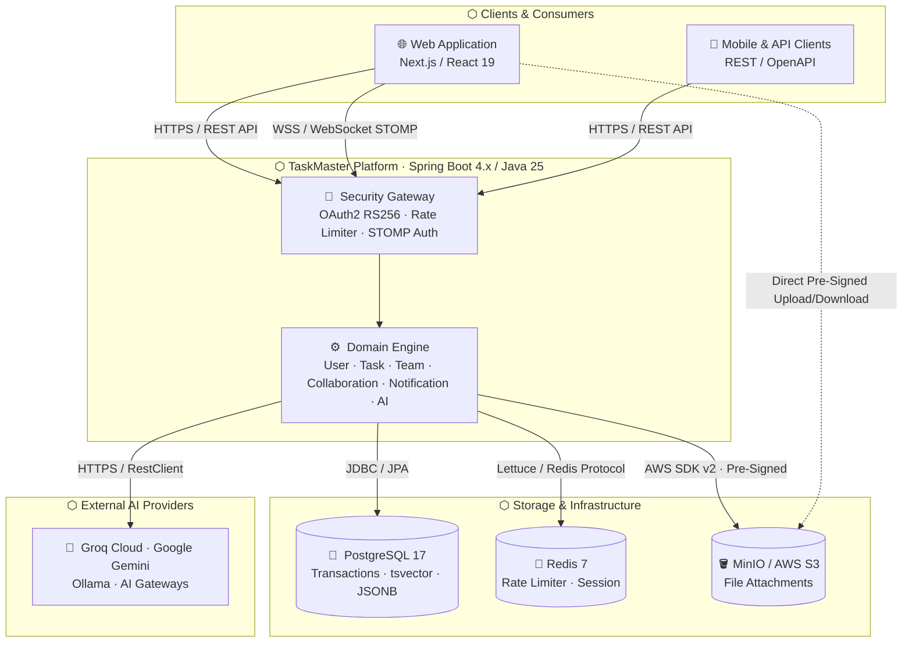

---

## 2. Container Architecture & Modular Monolith Boundary (C4 Level 2)

The platform is structured into clear vertical domain boundaries with zero cyclical dependencies, enforced at build time via **ArchUnit**.

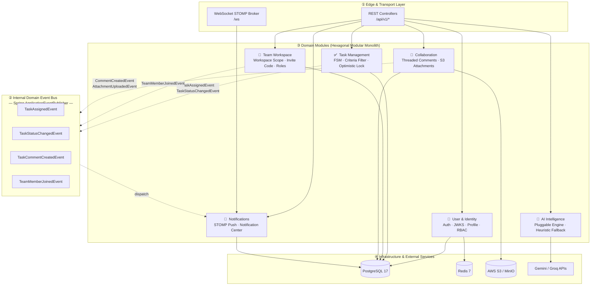

---

## 3. Component-Level Hexagonal Architecture (C4 Level 3)

Each domain module strictly adheres to the Hexagonal (Ports & Adapters) pattern. The domain core depends on no framework or infrastructure — only on its own port abstractions.

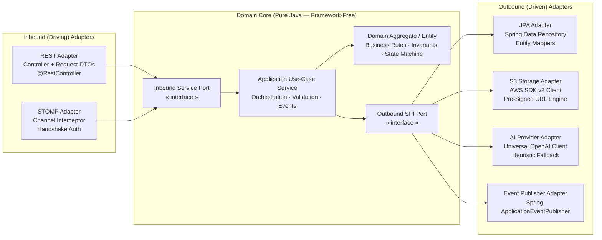

---

## 4. Security Perimeter & Ingress Pipeline

Every HTTP and WebSocket request traverses an ordered security and observability filter chain before reaching application handlers. Each gate returns a specific RFC 7807 `ProblemDetail` error on rejection.

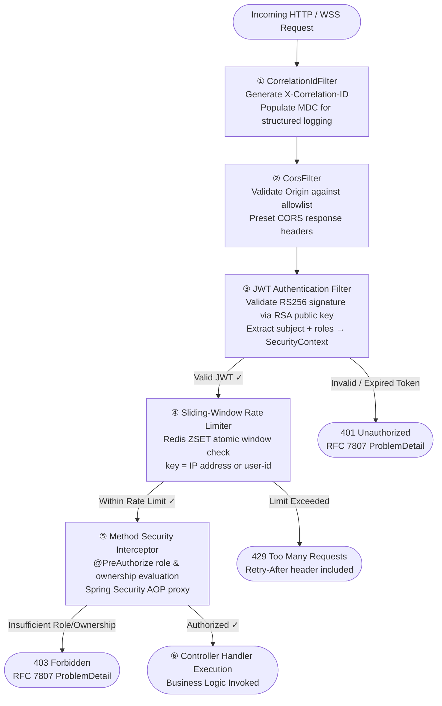

---

## 5. Subsystem Sequences & Core Workflows

---

### 5.1 Asymmetric Authentication & Token Family Rotation (RS256)

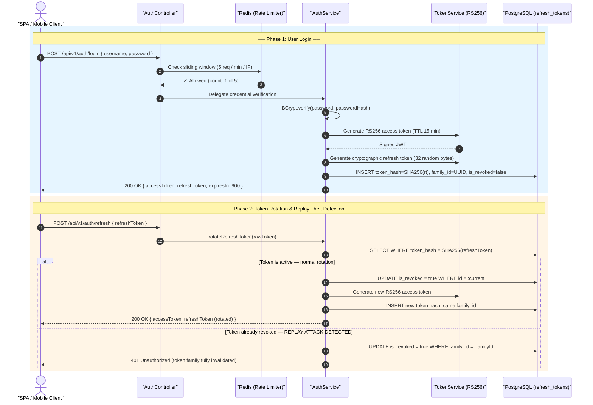

---

### 5.2 Task Lifecycle State Machine & Concurrency Conflict Resolution

The `TaskStatus` domain enum encapsulates all valid state transitions. Invalid transitions are rejected with `400 Bad Request` at the domain boundary — no if-chains in service code.

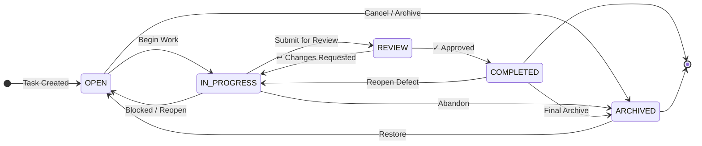

#### Concurrency Conflict Prevention — `@Version` Optimistic Locking

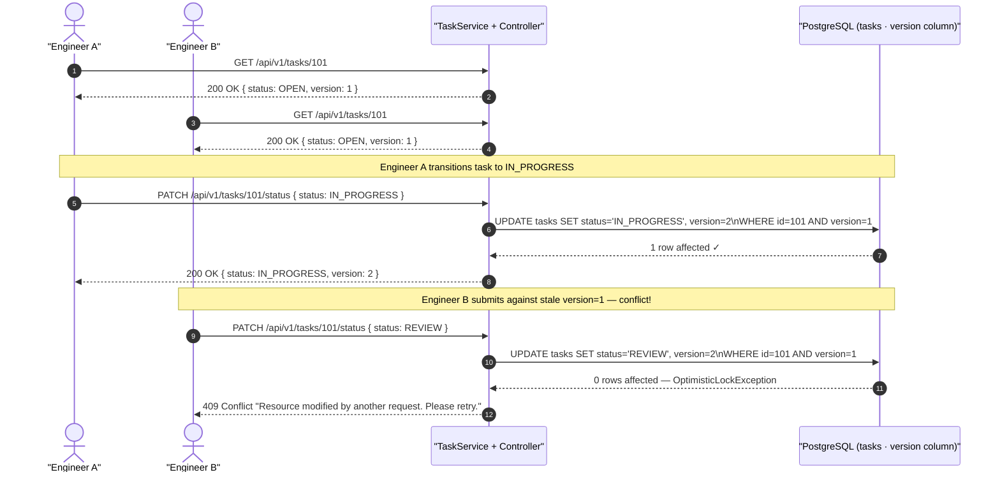

---

### 5.3 Threaded Discussions & Direct S3 Pre-Signed Storage

The application server never proxies file bytes — it delegates storage I/O to the object store directly via the AWS SDK, then issues a short-lived pre-signed URL to the client for direct download.

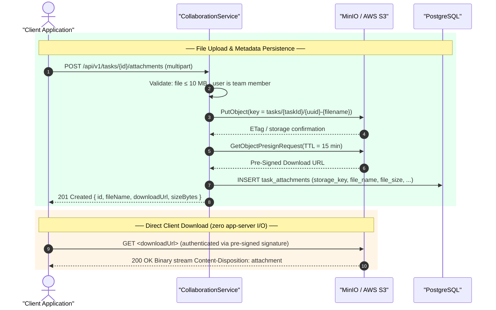

---

### 5.4 Real-Time Notification & WebSocket STOMP Pipeline

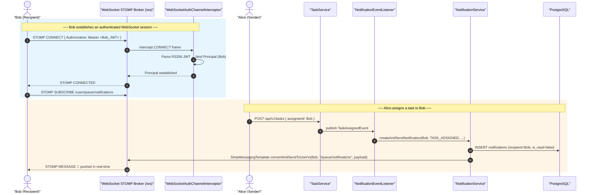

---

### 5.5 Pluggable Generative AI Multi-Provider Engine

The `PluggableAiProvider` sends a standard `POST /chat/completions` request using the OpenAI-compatible schema. Any compliant endpoint — cloud provider, local model, or AI gateway — is reachable by changing a single environment variable.

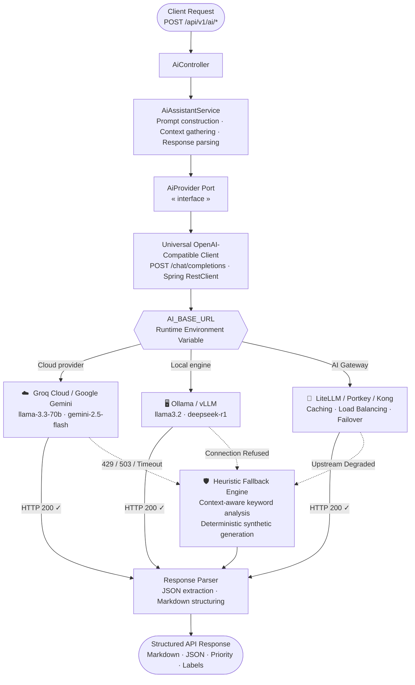

---

## 6. Event-Driven Decoupling & Messaging Topology

Domain events isolate transaction boundaries and guarantee loose coupling between aggregates. The event bus decouples producers from consumers — neither side references the other.

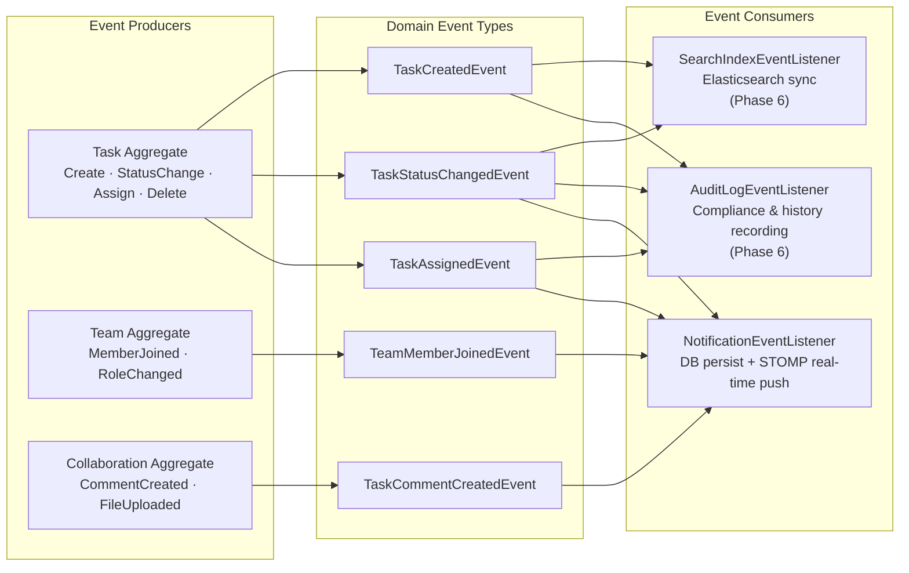

---

## 7. Database Architecture & Entity-Relationship Schema

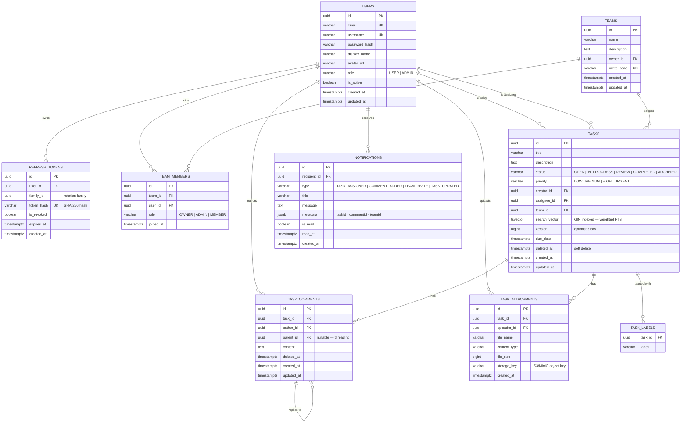

### High-Performance Indexing Strategy

| Index | SQL Definition | Purpose |
|:---|:---|:---|
| **Full-Text Search (GIN)** | `CREATE INDEX idx_tasks_fts ON tasks USING GIN (search_vector)` | Sub-millisecond full-text search on title + description |
| **Active Task Query** | `CREATE INDEX idx_tasks_team_active ON tasks (team_id, status) WHERE deleted_at IS NULL` | Team dashboard queries — partial index avoids deleted rows |
| **Unread Notifications** | `CREATE INDEX idx_notif_unread ON notifications (recipient_id) WHERE is_read = FALSE` | Unread badge count — partial index, extremely fast |
| **Comment Thread** | `CREATE INDEX idx_comments_thread ON task_comments (task_id, parent_id) WHERE deleted_at IS NULL` | Threaded comment tree reconstruction |
| **Token Lookup** | `CREATE INDEX idx_refresh_token_hash ON refresh_tokens (token_hash)` | O(log n) token verification on every `/auth/refresh` |

---

## 8. High-Performance Data & Storage Tier Lifecycle

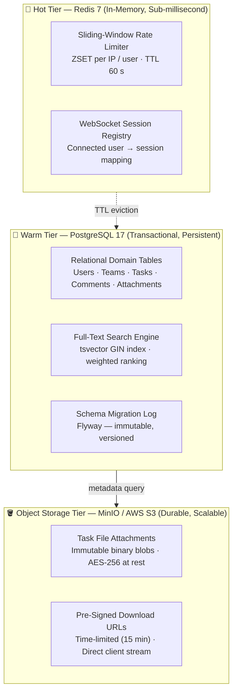

---

## 9. Observability, Metrics & Telemetry Pipeline

TaskMaster implements enterprise-grade observability following the **OpenTelemetry** and **Prometheus** standards. Every request carries a correlation ID through the full call stack, enabling end-to-end distributed tracing.

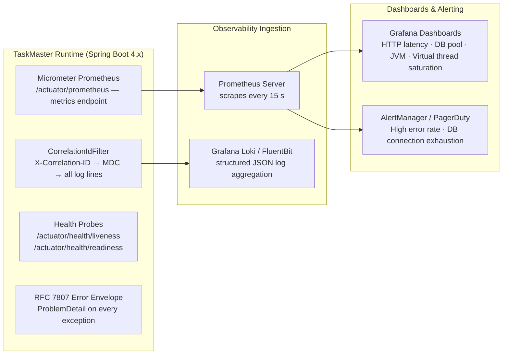

---

## 10. Cloud-Native Deployment & Container Topology

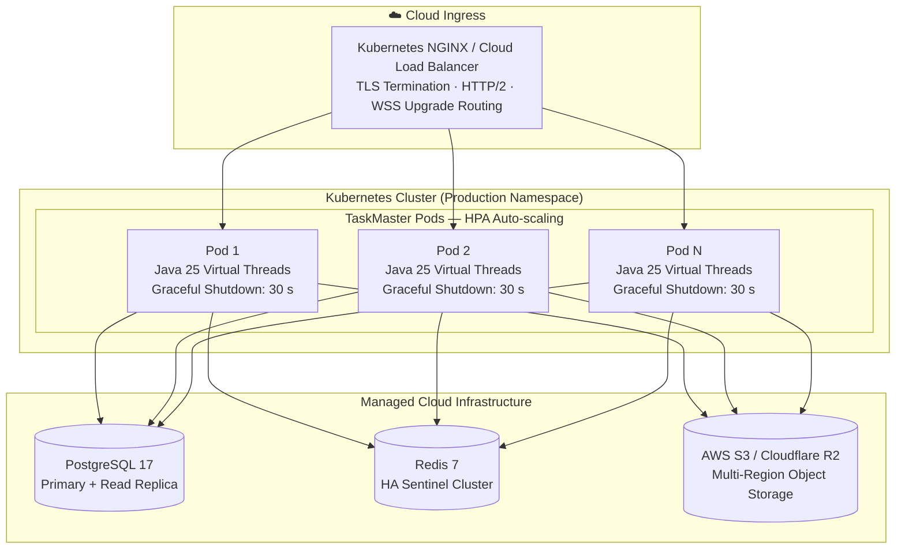

---

## 11. Technology Baseline Matrix

| Tier | Component | Selection | Architectural Rationale |
|:---|:---|:---|:---|
| **Runtime** | Language | **Java 25 (LTS)** | Virtual Threads (Project Loom), Records, Sealed Types, Pattern Matching. |
| **Framework** | Application Engine | **Spring Boot 4.x / Spring 7.0** | Jakarta EE 11 baseline, centralized BOM, RFC 7807 `ProblemDetail`. |
| **Security** | Auth & Signing | **Spring Security + Nimbus JOSE** | Asymmetric RS256 JWT, Public RFC 7517 JWKS endpoint, family-based replay mitigation. |
| **Database** | Relational Datastore | **PostgreSQL 17** | ACID transactions, Flyway migrations, `tsvector` GIN full-text search, JSONB. |
| **In-Memory** | Cache & Rate Limiter | **Redis 7 (Lettuce Client)** | Atomic ZSET sliding-window rate limiting, WebSocket session registry. |
| **Storage** | Object Storage | **MinIO / AWS S3 (AWS SDK v2)** | Direct pre-signed URL upload/download — zero app-server I/O bottleneck. |
| **Real-time** | Push Broker | **WebSocket + STOMP (SockJS)** | JWT-authenticated sessions, `convertAndSendToUser` point-to-point routing. |
| **AI Assistant** | Generative AI | **Universal OpenAI-Compatible Client** | Single `/chat/completions` adapter supporting Groq, Gemini, Ollama, AI Gateways. |
| **Observability** | Telemetry & Tracing | **OpenTelemetry (OTel) + OTLP** | CNCF standard vendor-neutral distributed tracing, W3C TraceContext, and Micrometer bridge. |
| **Mapping** | Object Mapping | **MapStruct 1.6** | Compile-time type-safe DTO ↔ Entity mapping — zero reflection overhead. |
| **API Docs** | Specification | **SpringDoc OpenAPI 3.1** | Auto-generated, always-in-sync Swagger UI at `/swagger-ui.html` + `docs/api/openapi.yaml`. |
| **Quality** | Testing & Verification | **ArchUnit + Testcontainers + Checkstyle** | Compile-time hexagonal boundary enforcement + containerised integration test slices. |
