# TaskMaster — System Architecture & Technical Design Specification

> **Document Metadata**
> - **Title**: TaskMaster Core System Architecture & Technical Design Specification
> - **Author**: TaskMaster Engineering (`shashakchandel@gmail.com`)
> - **Status**: Approved / Living Design Document
> - **Last Updated**: 2026-09-08
> - **Authoritative Location**: [docs/architecture.md](architecture.md)
> - **Related Documents**: [REST API Specification](api-specification.md) | [OpenAPI 3.1 Spec](api/openapi.yaml) | [Phased Roadmap](ROADMAP.md) | [Architecture Decisions (ADRs)](adr/README.md) | [Contributing Guide](../CONTRIBUTING.md)

This document provides the definitive, production-grade technical specification of the TaskMaster platform. It documents the end-to-end architecture, C4 structural diagrams, subsystem sequences, data schemas, security perimeters, resilience mechanisms, and cloud-native deployment topology.

---

## Table of Contents
1. [Architectural Principles & System Context (C4 Level 1)](#1-architectural-principles--system-context-c4-level-1)
2. [Container Architecture & Modular Monolith Boundary (C4 Level 2)](#2-container-architecture--modular-monolith-boundary-c4-level-2)
3. [Component-Level Hexagonal Architecture (C4 Level 3)](#3-component-level-hexagonal-architecture-c4-level-3)
4. [Security Perimeter & Ingress Pipeline](#4-security-perimeter--ingress-pipeline)
5. [Subsystem Sequences & Core Workflows](#5-subsystem-sequences--core-workflows)
   - 5.1 [Asymmetric Authentication & Token Family Rotation (RS256)](#51-asymmetric-authentication--token-family-rotation-rs256)
   - 5.2 [Task Lifecycle State Machine & Concurrency Conflict Resolution](#52-task-lifecycle-state-machine--concurrency-conflict-resolution)
   - 5.3 [Threaded Discussions & Direct S3 Pre-Signed Storage](#53-threaded-discussions--direct-s3-pre-signed-storage)
   - 5.4 [Real-Time Notification & WebSocket STOMP Pipeline](#54-real-time-notification--websocket-stomp-pipeline)
   - 5.5 [Pluggable Generative AI Multi-Provider Engine](#55-pluggable-generative-ai-multi-provider-engine)
6. [Event-Driven Decoupling & Messaging Topology](#6-event-driven-decoupling--messaging-topology)
7. [Database Architecture & Entity-Relationship Schema](#7-database-architecture--entity-relationship-schema)
8. [High-Performance Data & Storage Tier Lifecycle](#8-high-performance-data--storage-tier-lifecycle)
9. [Observability, Metrics & Telemetry Pipeline](#9-observability-metrics--telemetry-pipeline)
10. [Cloud-Native Deployment & Container Topology](#10-cloud-native-deployment--container-topology)
11. [Technology Baseline Matrix](#11-technology-baseline-matrix)

---

## 1. Architectural Principles & System Context (C4 Level 1)

TaskMaster is built as a **Modular Monolith using Hexagonal Architecture (Ports & Adapters)** on **Java 25 (LTS)** and **Spring Boot 4.x (Spring Framework 7.0)**.

### Core Architectural Principles
1. **Domain-Driven Boundary Isolation**: Business logic is encapsulated in pure domain models (`user`, `task`, `team`, `collaboration`, `notification`, `ai`).
2. **Ports and Adapters (Hexagonal)**: Core business rules depend only on domain port abstractions; infrastructure adapters (PostgreSQL, Redis, MinIO/S3, LLM APIs) implement these ports.
3. **Zero-Trust Asymmetric Security**: Token verification relies on asymmetric RS256 cryptography with public RFC 7517 JWKS discovery and family-based refresh token theft mitigation.
4. **Event-Driven Decoupling**: Domain mutations emit strongly typed domain events, decoupling core transactions from side effects (notifications, audit logging, analytics).
5. **Direct Binary Storage Offloading**: Web application threads are protected from I/O exhaustion by offloading large file uploads and downloads directly to S3-compatible object stores via pre-signed URLs.

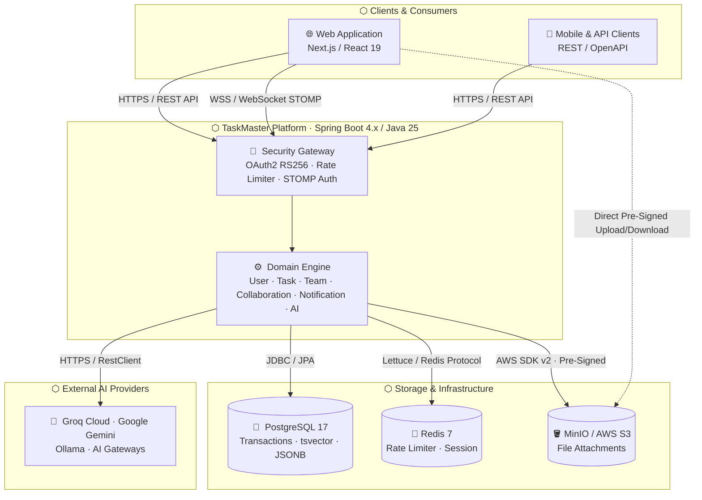
```mermaid
flowchart TB
    subgraph CLIENTS["⬡  Clients & Consumers"]
        WebUI["🌐  Web Application\nNext.js / React 19"]
        MobileAPI["📱  Mobile & API Clients\nREST / OpenAPI"]
    end

    subgraph APP["⬡  TaskMaster Platform  ·  Spring Boot 4.x / Java 25"]
        direction LR
        SecGW["🔐  Security Gateway\nOAuth2 RS256 · Rate Limiter · STOMP Auth"]
        Engine["⚙️  Domain Engine\nUser · Task · Team · Collaboration · Notification · AI"]
        SecGW --> Engine
    end

    subgraph STORAGE["⬡  Storage & Infrastructure"]
        direction LR
        PG[("🐘  PostgreSQL 17\nTransactions · tsvector · JSONB")]
        Redis[("🔴  Redis 7\nRate Limiter · Session")]
        S3[("🪣  MinIO / AWS S3\nFile Attachments")]
    end

    subgraph AI["⬡  External AI Providers"]
        LLM["🤖  Groq Cloud · Google Gemini\nOllama · AI Gateways"]
    end

    WebUI   -- "HTTPS / REST API"          --> SecGW
    WebUI   -- "WSS / WebSocket STOMP"     --> SecGW
    MobileAPI -- "HTTPS / REST API"        --> SecGW

    Engine  -- "JDBC / JPA"               --> PG
    Engine  -- "Lettuce / Redis Protocol"  --> Redis
    Engine  -- "AWS SDK v2 · Pre-Signed"   --> S3
    Engine  -- "HTTPS / RestClient"        --> LLM

    WebUI   -. "Direct Pre-Signed Upload/Download" .-> S3
```

---

## 2. Container Architecture & Modular Monolith Boundary (C4 Level 2)

The platform is structured into clear vertical domain boundaries with zero cyclical dependencies, enforced at build time via **ArchUnit**.

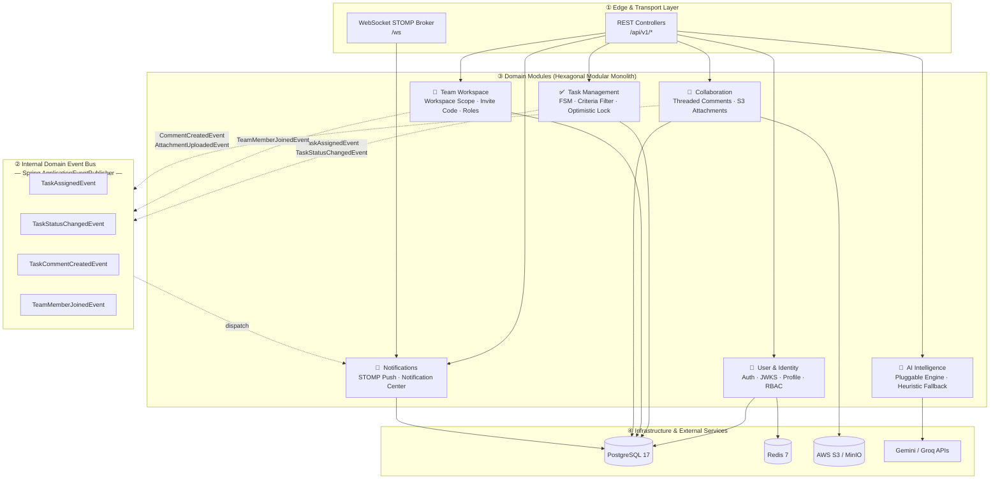
```mermaid
flowchart TB
    subgraph EDGE["① Edge & Transport Layer"]
        direction LR
        REST["REST Controllers\n/api/v1/*"]
        WS["WebSocket STOMP Broker\n/ws"]
    end

    subgraph BUS["② Internal Domain Event Bus\n— Spring ApplicationEventPublisher —"]
        E_ASSIGN["TaskAssignedEvent"]
        E_STATUS["TaskStatusChangedEvent"]
        E_COMMENT["TaskCommentCreatedEvent"]
        E_MEMBER["TeamMemberJoinedEvent"]
    end

    subgraph MODULES["③ Domain Modules  (Hexagonal Modular Monolith)"]
        direction LR
        USER["👤  User & Identity\nAuth · JWKS · Profile · RBAC"]
        TASK["✅  Task Management\nFSM · Criteria Filter · Optimistic Lock"]
        TEAM["👥  Team Workspace\nWorkspace Scope · Invite Code · Roles"]
        COLLAB["💬  Collaboration\nThreaded Comments · S3 Attachments"]
        NOTIF["🔔  Notifications\nSTOMP Push · Notification Center"]
        AI["🤖  AI Intelligence\nPluggable Engine · Heuristic Fallback"]
    end

    subgraph INFRA["④ Infrastructure & External Services"]
        direction LR
        PG[("PostgreSQL 17")]
        Redis[("Redis 7")]
        S3[("AWS S3 / MinIO")]
        LLM["Gemini / Groq APIs"]
    end

    %% Ingress routing
    REST --> USER
    REST --> TASK
    REST --> TEAM
    REST --> COLLAB
    REST --> NOTIF
    REST --> AI
    WS  --> NOTIF

    %% Domain event emissions
    TASK   -. "TaskAssignedEvent\nTaskStatusChangedEvent"  .-> BUS
    TEAM   -. "TeamMemberJoinedEvent"                      .-> BUS
    COLLAB -. "CommentCreatedEvent\nAttachmentUploadedEvent" .-> BUS
    BUS    -. "dispatch"                                   .-> NOTIF

    %% Infrastructure connections
    USER   --> PG
    USER   --> Redis
    TASK   --> PG
    TEAM   --> PG
    COLLAB --> PG
    COLLAB --> S3
    NOTIF  --> PG
    AI     --> LLM
```

---

## 3. Component-Level Hexagonal Architecture (C4 Level 3)

Each domain module strictly adheres to the Hexagonal (Ports & Adapters) pattern. The domain core depends on no framework or infrastructure — only on its own port abstractions.

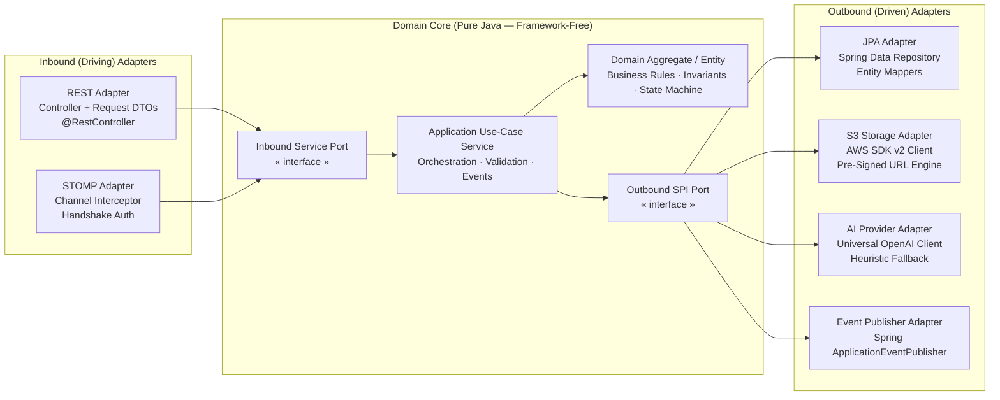
```mermaid
flowchart LR
    subgraph IN["Inbound  (Driving) Adapters"]
        direction TB
        HTTP["REST Adapter\nController + Request DTOs\n@RestController"]
        STOMP["STOMP Adapter\nChannel Interceptor\nHandshake Auth"]
    end

    subgraph CORE["Domain Core  (Pure Java — Framework-Free)"]
        direction TB
        IPORT["Inbound Service Port\n« interface »"]
        SVC["Application Use-Case Service\nOrchestration · Validation · Events"]
        DOM["Domain Aggregate / Entity\nBusiness Rules · Invariants · State Machine"]
        OPORT["Outbound SPI Port\n« interface »"]

        IPORT --> SVC
        SVC   --> DOM
        SVC   --> OPORT
    end

    subgraph OUT["Outbound  (Driven) Adapters"]
        direction TB
        JPA["JPA Adapter\nSpring Data Repository\nEntity Mappers"]
        S3A["S3 Storage Adapter\nAWS SDK v2 Client\nPre-Signed URL Engine"]
        AIA["AI Provider Adapter\nUniversal OpenAI Client\nHeuristic Fallback"]
        EVT["Event Publisher Adapter\nSpring ApplicationEventPublisher"]
    end

    HTTP  --> IPORT
    STOMP --> IPORT

    OPORT --> JPA
    OPORT --> S3A
    OPORT --> AIA
    OPORT --> EVT
```

---

## 4. Security Perimeter & Ingress Pipeline

Every HTTP and WebSocket request traverses an ordered security and observability filter chain before reaching application handlers. Each gate returns a specific RFC 7807 `ProblemDetail` error on rejection.

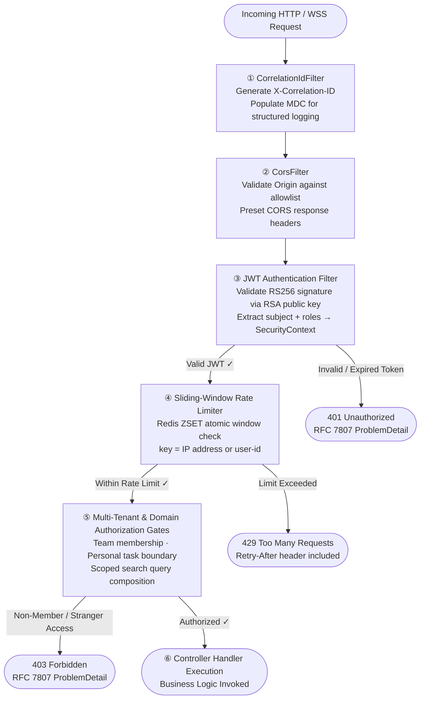
```mermaid
flowchart TD
    REQ(["Incoming HTTP / WSS Request"])

    REQ      --> F1

    F1["① CorrelationIdFilter\nGenerate X-Correlation-ID\nPopulate MDC for structured logging"]
    F2["② CorsFilter\nValidate Origin against allowlist\nPreset CORS response headers"]
    F3["③ JWT Authentication Filter\nValidate RS256 signature via RSA public key\nExtract subject + roles → SecurityContext"]
    F4["④ Sliding-Window Rate Limiter\nRedis ZSET atomic window check\nkey = IP address or user-id"]
    F5["⑤ Multi-Tenant & Domain Authorization Gates\nTeam membership · Personal task boundary\nScoped search query composition"]
    OK(["⑥ Controller Handler Execution\nBusiness Logic Invoked"])

    E401(["401 Unauthorized\nRFC 7807 ProblemDetail"])
    E429(["429 Too Many Requests\nRetry-After header included"])
    E403(["403 Forbidden\nRFC 7807 ProblemDetail"])

    F1 --> F2
    F2 --> F3

    F3 -- "Invalid / Expired Token"    --> E401
    F3 -- "Valid JWT ✓"                --> F4

    F4 -- "Limit Exceeded"             --> E429
    F4 -- "Within Rate Limit ✓"        --> F5

    F5 -- "Non-Member / Stranger Access" --> E403
    F5 -- "Authorized ✓"               --> OK
```

### 4.1 Ingress Filter & Rate Limiting Chain
- **Correlation Tracking**: Injected via `CorrelationIdFilter` on inbound requests, mapped to SLF4J MDC, and returned via `X-Correlation-ID` header.
- **CORS Defense**: Enforced by `CorsConfig` validating incoming origins against configurable `app.cors.allowed-origins`. Wildcard `*` is strictly prohibited in production.
- **Asymmetric RS256 JWT Verification**: Inbound Bearer tokens are verified against the RSA public key. Public keys are exposed via RFC 7517 JWKS (`/.well-known/jwks.json`).
- **Sliding-Window Rate Limiting**: Managed via Redis atomic ZSET sliding windows with automatic fallback to bounded in-memory Caffeine caches.

### 4.2 Multi-Tenant Data Isolation & Authorization Architecture
TaskMaster enforces zero-trust data segregation across multi-user workspaces and private personal workflows:

1. **Team Workspace Boundary**:
   - Every team-scoped resource (team tasks, comments, attachments, workspaces) requires verified membership in `team_members` (`teamMemberRepository.findRoleByTeamIdAndUserId`).
   - Non-members attempting read, write, assign, or delete operations receive RFC 7807 `403 Forbidden` (`You do not have permission to access tasks in this team`).
2. **Personal Task Boundary (`teamId == null`)**:
   - Tasks created without a team are strictly private to the creator and assignee.
   - **Read, Update, and Status Transitions**: Permitted only if `currentUserId.equals(creator.getId()) || currentUserId.equals(assignee.getId())`. Any stranger receives `403 Forbidden` (`You do not have permission to access this task`).
   - **Assignment and Deletion**: Restricted exclusively to the task creator (`currentUserId.equals(creator.getId())`).
3. **Multi-Tenant Search & Query Scoping (`TaskSpecification`)**:
   - The query search endpoint (`GET /api/v1/tasks`) extracts `currentUserId` directly from the validated `@AuthenticationPrincipal Jwt`.
   - **Explicit Team Query (`teamId != null`)**: The user's membership in the target team is verified before executing the query. If the user is not a member, `403 Forbidden` is returned immediately.
   - **Global Search (`teamId == null`)**: Dynamic JPA Specification constructs a database-level isolation predicate:
     ```sql
     WHERE (team_id IN (:allowedTeamIds))
        OR (team_id IS NULL AND (created_by = :currentUserId OR assignee_id = :currentUserId))
     ```
     Users can only discover tasks belonging to teams they have joined, plus their own personal tasks. Strangers' personal tasks and unjoined team backlogs are entirely invisible.
4. **Subsystem Authorization Parity**:
   - **Collaboration (Comments & Attachments)**: `TaskCommentService` and `TaskAttachmentService` execute the identical team membership and personal task access checks prior to reading or modifying discussions and binary files.
   - **AI Assistant**: `AiAssistantService.summarizeTask` validates task access, and `detectDuplicates` scopes candidate similarity comparisons strictly to user-accessible tasks and joined teams.

### 4.3 STRIDE Threat Modeling Analysis

The platform attack surface is systematically modeled against the **STRIDE** methodology for collaborative task and multi-tenant platforms:

| Threat Category | Threat Description | Attack Vector | TaskMaster Architectural Mitigation | Architectural Reference |
| :--- | :--- | :--- | :--- | :--- |
| **Spoofing** | Forged user identity or access token tampering | Submitting requests with modified JWT payload or expired claims | Asymmetric RS256 signature verification with 2048-bit RSA PEM key pairs; public key discovery via RFC 7517 JWKS; `@AuthenticationPrincipal` extraction from validated JWT subject claim. | [ADR 0001](adr/0001-modular-monolith.md), [ADR 0009](adr/0009-multi-tenant-task-authorization-hardening.md) |
| **Tampering** | Concurrent write overwrites or unauthorized status changes | Race conditions on concurrent status updates or modifying task payloads | JPA `@Version` optimistic locking (returning RFC 7807 `409 Conflict`); validated `TaskStatus` state machine; transactional boundaries via `@Transactional`. | [ADR 0002](adr/0002-postgresql.md), [ADR 0003](adr/0003-hexagonal-architecture.md) |
| **Repudiation** | Denying task assignment, status transition, or comment modification | Claiming a task was updated without user consent or unauthorized deletion | Strongly typed domain events (`TaskAssignedEvent`, `TaskStatusChangedEvent`); immutable audit fields (`created_at`, `updated_at`, `AuditAwareImpl`); structured JSON logs with `X-Correlation-ID` and OTel `traceId`. | [ADR 0004](adr/0004-spring-cloud-stream.md), [ADR 0006](adr/0006-opentelemetry-vendor-neutrality.md) |
| **Information Disclosure** | Insecure Direct Object Reference (IDOR) or cross-tenant snooping | Scanning task UUIDs (`/api/v1/tasks/{id}`) or listing all tasks | Personal tasks are strictly isolated to creator and assignee; team tasks require active team membership; global search queries (`GET /api/v1/tasks`) are dynamically scoped via JPA `TaskSpecification` at the SQL level. | [ADR 0007](adr/0007-free-tier-pluggable-infrastructure.md), [ADR 0009](adr/0009-multi-tenant-task-authorization-hardening.md) |
| **Denial of Service (DoS)** | Brute force login floods or application thread pool starvation | Rapid auth requests or large file streaming hammering web threads | Redis atomic sliding-window rate limiter with Caffeine bounded LRU fallback; AWS SDK v2 direct pre-signed URL download offloading (zero app-server I/O overhead); Java 25 Virtual Threads. | [ADR 0006](adr/0006-opentelemetry-vendor-neutrality.md), [ADR 0007](adr/0007-free-tier-pluggable-infrastructure.md) |
| **Elevation of Privilege** | Member attempting administrative actions or deleting workspace | Regular workspace member calling delete team or modifying member roles | Strict RBAC governance (`OWNER`, `ADMIN`, `MEMBER`); team mutation endpoints verify role authority; only workspace `OWNER` can delete team or adjust roles. | [ADR 0001](adr/0001-modular-monolith.md), [ADR 0003](adr/0003-hexagonal-architecture.md) |

### 4.4 Identity & Access Management (IAM) & Endpoint Policy Matrix

| Endpoint | Method | Access Policy | Authentication Required | Enforcement Mechanism |
| :--- | :--- | :--- | :--- | :--- |
| `/api/v1/auth/register`, `/login`, `/refresh` | `POST` | Public | No | Sliding-window rate limiter (5 req/min/IP), BCrypt verification, refresh token rotation |
| `/api/v1/auth/.well-known/jwks.json` | `GET` | Public | No | RFC 7517 RSA public key set |
| `/api/v1/users/me` | `GET`, `PUT` | Principal-Bound | Yes (`Bearer JWT`) | Retrieves/updates authenticated user's own profile |
| `/api/v1/teams` | `POST` | Authenticated | Yes (`Bearer JWT`) | Creates workspace and assigns caller as `OWNER` |
| `/api/v1/teams/{id}` | `GET`, `DELETE` | Team-Bound | Yes (`Bearer JWT`) | Verified via `team_members`; delete restricted to `OWNER` |
| `/api/v1/teams/join` | `POST` | Authenticated | Yes (`Bearer JWT`) | Validates cryptographic workspace invite code |
| `/api/v1/tasks` | `GET` | Scoped Multi-Tenant | Yes (`Bearer JWT`) | Scoped to member teams and personal tasks via `TaskSpecification` |
| `/api/v1/tasks` | `POST` | Authenticated | Yes (`Bearer JWT`) | Associates task with caller; verifies team if `teamId` supplied |
| `/api/v1/tasks/{id}` | `GET` | Dual-Boundary | Yes (`Bearer JWT`) | Team Member (if team task) OR Creator/Assignee (if personal task) |
| `/api/v1/tasks/{id}` | `PUT` | Dual-Boundary | Yes (`Bearer JWT`) | Team Member (if team task) OR Creator/Assignee (if personal task) |
| `/api/v1/tasks/{id}/status` | `PATCH` | Dual-Boundary | Yes (`Bearer JWT`) | Team Member (if team task) OR Creator/Assignee (if personal task) |
| `/api/v1/tasks/{id}/assign` | `PATCH` | Creator/Team-Bound | Yes (`Bearer JWT`) | Team Member (if team task) OR Creator (if personal task) |
| `/api/v1/tasks/{id}` | `DELETE` | Creator/Team-Bound | Yes (`Bearer JWT`) | Team Member (if team task) OR Creator (if personal task) |
| `/api/v1/tasks/{id}/comments` | `POST`, `GET` | Dual-Boundary | Yes (`Bearer JWT`) | Team Member OR Personal Task Creator/Assignee |
| `/api/v1/tasks/{id}/comments/{cId}` | `PUT`, `DELETE` | Author-Bound | Yes (`Bearer JWT`) | Verified comment author + task access |
| `/api/v1/tasks/{id}/attachments` | `POST`, `GET` | Dual-Boundary | Yes (`Bearer JWT`) | Team Member OR Personal Task Creator/Assignee |
| `/api/v1/notifications/**` | `GET`, `PATCH` | Principal-Bound | Yes (`Bearer JWT`) | Restricted to recipient user ID |
| `/api/v1/ai/**` | `POST` | Dual-Boundary | Yes (`Bearer JWT`) | Validates access to referenced tasks; scopes duplicate detection |
| `/actuator/health/**`, `/prometheus` | `GET` | Public / Scraping | No | Prometheus scraper and Kubernetes probes |
| `/swagger-ui/**`, `/v3/api-docs/**` | `GET` | Public | No | Interactive OpenAPI 3.1 documentation |


---

## 5. Subsystem Sequences & Core Workflows

---

### 5.1 Asymmetric Authentication & Token Family Rotation (RS256)

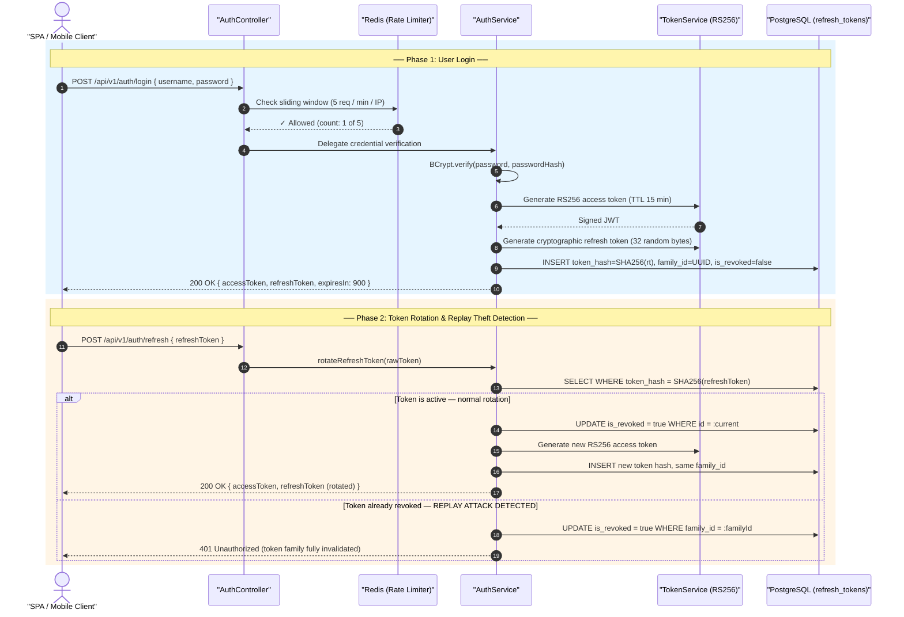
```mermaid
sequenceDiagram
    autonumber

    actor     Client   as "SPA / Mobile Client"
    participant AuthCtrl as "AuthController"
    participant Redis    as "Redis  (Rate Limiter)"
    participant AuthSvc  as "AuthService"
    participant TokenSvc as "TokenService  (RS256)"
    participant DB       as "PostgreSQL  (refresh_tokens)"

    rect rgb(230, 245, 255)
        Note over Client, DB: ── Phase 1: User Login ──
        Client   ->>  AuthCtrl: POST /api/v1/auth/login  { username, password }
        AuthCtrl ->>  Redis:    Check sliding window  (5 req / min / IP)
        Redis    -->> AuthCtrl: ✓ Allowed  (count: 1 of 5)
        AuthCtrl ->>  AuthSvc:  Delegate credential verification
        AuthSvc  ->>  AuthSvc:  BCrypt.verify(password, passwordHash)
        AuthSvc  ->>  TokenSvc: Generate RS256 access token  (TTL 15 min)
        TokenSvc -->> AuthSvc:  Signed JWT
        AuthSvc  ->>  TokenSvc: Generate cryptographic refresh token  (32 random bytes)
        AuthSvc  ->>  DB:       INSERT  token_hash=SHA256(rt), family_id=UUID, is_revoked=false
        AuthSvc  -->> Client:   200 OK  { accessToken, refreshToken, expiresIn: 900 }
    end

    rect rgb(255, 245, 230)
        Note over Client, DB: ── Phase 2: Token Rotation & Replay Theft Detection ──
        Client   ->>  AuthCtrl: POST /api/v1/auth/refresh  { refreshToken }
        AuthCtrl ->>  AuthSvc:  rotateRefreshToken(rawToken)
        AuthSvc  ->>  DB:       SELECT WHERE token_hash = SHA256(refreshToken)

        alt Token is active — normal rotation
            AuthSvc  ->>  DB:      UPDATE  is_revoked = true  WHERE id = :current
            AuthSvc  ->>  TokenSvc: Generate new RS256 access token
            AuthSvc  ->>  DB:      INSERT  new token hash, same family_id
            AuthSvc  -->> Client:  200 OK  { accessToken, refreshToken (rotated) }
        else Token already revoked — REPLAY ATTACK DETECTED
            AuthSvc  ->>  DB:      UPDATE  is_revoked = true  WHERE family_id = :familyId
            AuthSvc  -->> Client:  401 Unauthorized  (token family fully invalidated)
        end
    end
```

---

### 5.2 Task Lifecycle State Machine & Concurrency Conflict Resolution

The `TaskStatus` domain enum encapsulates all valid state transitions. Invalid transitions are rejected with `400 Bad Request` at the domain boundary — no if-chains in service code.

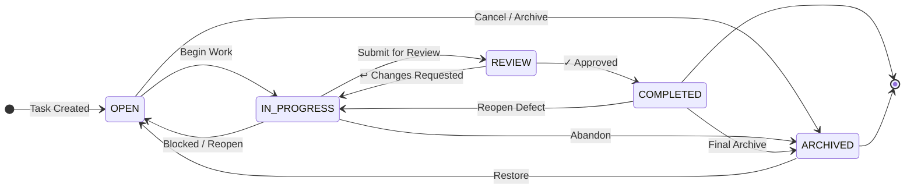
```mermaid
stateDiagram-v2
    direction LR

    [*]         --> OPEN       : Task Created

    OPEN        --> IN_PROGRESS : Begin Work
    OPEN        --> ARCHIVED    : Cancel / Archive

    IN_PROGRESS --> REVIEW      : Submit for Review
    IN_PROGRESS --> OPEN        : Blocked / Reopen
    IN_PROGRESS --> ARCHIVED    : Abandon

    REVIEW      --> COMPLETED   : ✓ Approved
    REVIEW      --> IN_PROGRESS : ↩ Changes Requested

    COMPLETED   --> ARCHIVED    : Final Archive
    COMPLETED   --> IN_PROGRESS : Reopen Defect

    ARCHIVED    --> OPEN        : Restore

    COMPLETED   --> [*]
    ARCHIVED    --> [*]
```

#### Concurrency Conflict Prevention — `@Version` Optimistic Locking

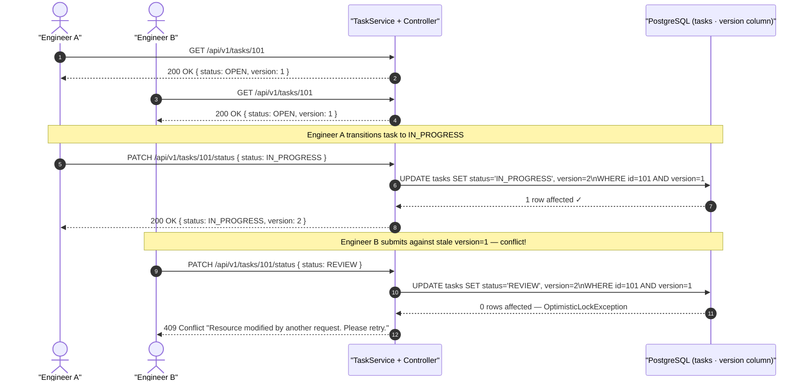
```mermaid
sequenceDiagram
    autonumber

    actor EngrA as "Engineer A"
    actor EngrB as "Engineer B"
    participant API  as "TaskService + Controller"
    participant DB   as "PostgreSQL  (tasks · version column)"

    EngrA ->> API: GET /api/v1/tasks/101
    API  -->> EngrA: 200 OK  { status: OPEN, version: 1 }

    EngrB ->> API: GET /api/v1/tasks/101
    API  -->> EngrB: 200 OK  { status: OPEN, version: 1 }

    Note over EngrA, DB: Engineer A transitions task to IN_PROGRESS
    EngrA ->> API: PATCH /api/v1/tasks/101/status  { status: IN_PROGRESS }
    API  ->>  DB:  UPDATE tasks SET status='IN_PROGRESS', version=2\nWHERE id=101 AND version=1
    DB  -->>  API: 1 row affected ✓
    API -->> EngrA: 200 OK  { status: IN_PROGRESS, version: 2 }

    Note over EngrB, DB: Engineer B submits against stale version=1 — conflict!
    EngrB ->> API: PATCH /api/v1/tasks/101/status  { status: REVIEW }
    API  ->>  DB:  UPDATE tasks SET status='REVIEW', version=2\nWHERE id=101 AND version=1
    DB  -->>  API: 0 rows affected — OptimisticLockException
    API -->> EngrB: 409 Conflict  "Resource modified by another request. Please retry."
```

---

### 5.3 Threaded Discussions & Direct S3 Pre-Signed Storage

The application server never proxies file bytes — it delegates storage I/O to the object store directly via the AWS SDK, then issues a short-lived pre-signed URL to the client for direct download.

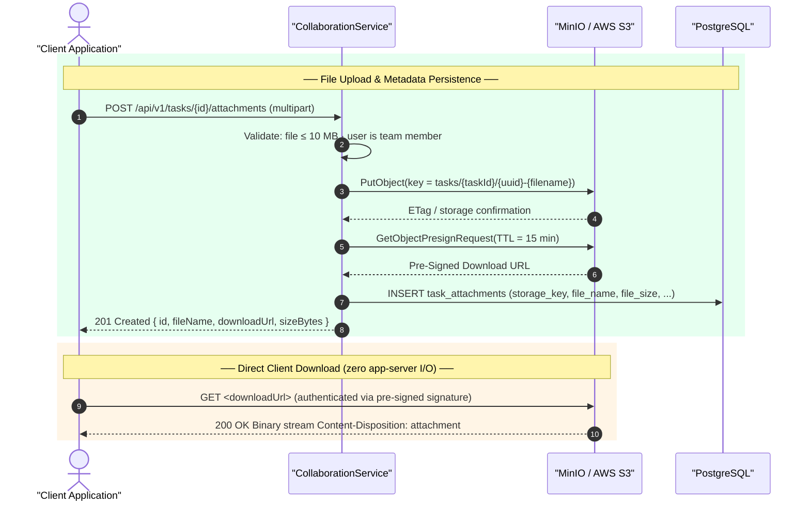
```mermaid
sequenceDiagram
    autonumber

    actor Client  as "Client Application"
    participant API  as "CollaborationService"
    participant S3   as "MinIO / AWS S3"
    participant DB   as "PostgreSQL"

    rect rgb(230, 255, 240)
        Note over Client, DB: ── File Upload & Metadata Persistence ──
        Client ->>  API: POST /api/v1/tasks/{id}/attachments  (multipart)
        API    ->>  API: Validate: file ≤ 10 MB · user is team member
        API    ->>  S3:  PutObject(key = tasks/{taskId}/{uuid}-{filename})
        S3    -->>  API: ETag / storage confirmation
        API    ->>  S3:  GetObjectPresignRequest(TTL = 15 min)
        S3    -->>  API: Pre-Signed Download URL
        API    ->>  DB:  INSERT task_attachments (storage_key, file_name, file_size, ...)
        API   -->>  Client: 201 Created  { id, fileName, downloadUrl, sizeBytes }
    end

    rect rgb(255, 245, 230)
        Note over Client, S3: ── Direct Client Download  (zero app-server I/O) ──
        Client ->>  S3:  GET <downloadUrl>  (authenticated via pre-signed signature)
        S3    -->>  Client: 200 OK  Binary stream  Content-Disposition: attachment
    end
```

---

### 5.4 Real-Time Notification & WebSocket STOMP Pipeline

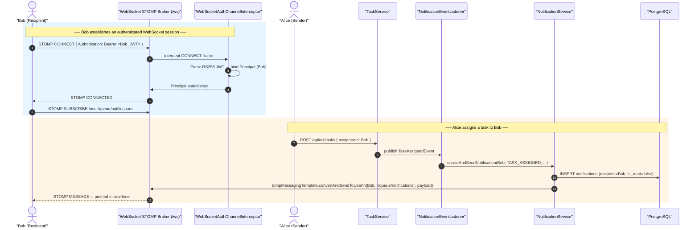
```mermaid
sequenceDiagram
    autonumber

    actor Bob    as "Bob  (Recipient)"
    participant Broker    as "WebSocket STOMP Broker  (/ws)"
    participant Intercept as "WebSocketAuthChannelInterceptor"
    actor Alice  as "Alice  (Sender)"
    participant TaskSvc   as "TaskService"
    participant Listener  as "NotificationEventListener"
    participant NotifSvc  as "NotificationService"
    participant DB        as "PostgreSQL"

    rect rgb(230, 245, 255)
        Note over Bob, Intercept: ── Bob establishes an authenticated WebSocket session ──
        Bob      ->>  Broker:    STOMP CONNECT  { Authorization: Bearer <Bob_JWT> }
        Broker   ->>  Intercept: intercept CONNECT frame
        Intercept ->> Intercept: Parse RS256 JWT → bind Principal (Bob)
        Intercept -->> Broker:   Principal established
        Broker   -->> Bob:       STOMP CONNECTED
        Bob      ->>  Broker:    STOMP SUBSCRIBE  /user/queue/notifications
    end

    rect rgb(255, 245, 230)
        Note over Alice, DB: ── Alice assigns a task to Bob ──
        Alice    ->>  TaskSvc:  POST /api/v1/tasks  { assigneeId: Bob }
        TaskSvc  ->>  Listener: publish TaskAssignedEvent
        Listener ->>  NotifSvc: createAndSendNotification(Bob, TASK_ASSIGNED, ...)
        NotifSvc ->>  DB:       INSERT notifications  (recipient=Bob, is_read=false)
        NotifSvc ->>  Broker:   SimpMessagingTemplate.convertAndSendToUser\n(Bob, "/queue/notifications", payload)
        Broker   -->> Bob:      STOMP MESSAGE  🔔  pushed in real-time
    end
```

---

### 5.5 Pluggable Generative AI Multi-Provider Engine

The `PluggableAiProvider` sends a standard `POST /chat/completions` request using the OpenAI-compatible schema. Any compliant endpoint — cloud provider, local model, or AI gateway — is reachable by changing a single environment variable.

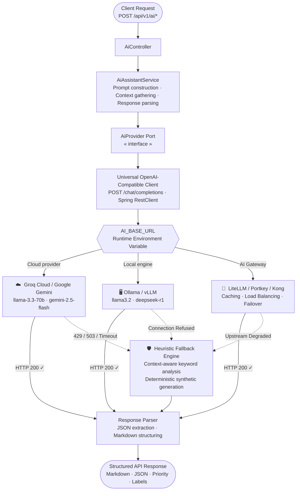
```mermaid
flowchart TD
    REQ(["Client Request\nPOST /api/v1/ai/*"])

    REQ      --> CTRL["AiController"]
    CTRL     --> SVC["AiAssistantService\nPrompt construction · Context gathering · Response parsing"]
    SVC      --> PORT["AiProvider Port\n« interface »"]
    PORT     --> ENG["Universal OpenAI-Compatible Client\nPOST /chat/completions · Spring RestClient"]

    ENG      --> ROUTE{{"AI_BASE_URL\nRuntime Environment Variable"}}

    ROUTE    -- "Cloud provider" --> CLOUD["☁️  Groq Cloud / Google Gemini\nllama-3.3-70b · gemini-2.5-flash"]
    ROUTE    -- "Local engine"   --> LOCAL["🖥️  Ollama / vLLM\nllama3.2 · deepseek-r1"]
    ROUTE    -- "AI Gateway"     --> GW["🔀  LiteLLM / Portkey / Kong\nCaching · Load Balancing · Failover"]

    CLOUD    -- "HTTP 200 ✓"     --> PARSE
    LOCAL    -- "HTTP 200 ✓"     --> PARSE
    GW       -- "HTTP 200 ✓"     --> PARSE

    CLOUD    -. "429 / 503 / Timeout" .-> FALLBACK
    LOCAL    -. "Connection Refused"  .-> FALLBACK
    GW       -. "Upstream Degraded"   .-> FALLBACK

    FALLBACK["🛡️  Heuristic Fallback Engine\nContext-aware keyword analysis\nDeterministic synthetic generation"]
    FALLBACK --> PARSE

    PARSE["Response Parser\nJSON extraction · Markdown structuring"]
    PARSE    --> RESP(["Structured API Response\nMarkdown · JSON · Priority · Labels"])
```

---

## 6. Event-Driven Decoupling & Messaging Topology

Domain events isolate transaction boundaries and guarantee loose coupling between aggregates. The event bus decouples producers from consumers — neither side references the other.

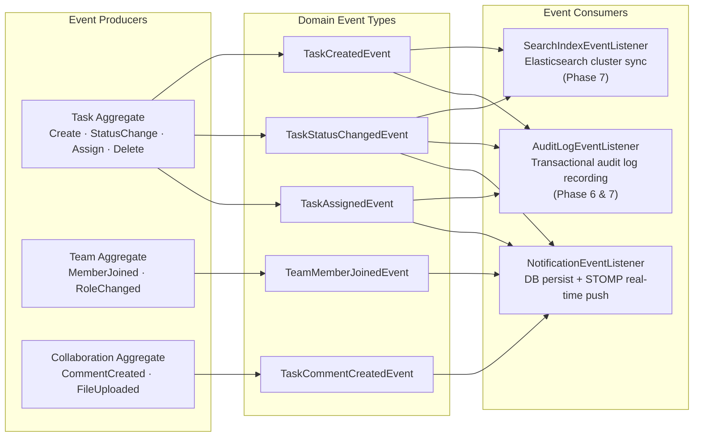
```mermaid
flowchart LR
    subgraph PROD["Event Producers"]
        direction TB
        TaskAgg["Task Aggregate\nCreate · StatusChange · Assign · Delete"]
        TeamAgg["Team Aggregate\nMemberJoined · RoleChanged"]
        CollAgg["Collaboration Aggregate\nCommentCreated · FileUploaded"]
    end

    subgraph EVENTS["Domain Event Types"]
        direction TB
        EV1["TaskAssignedEvent"]
        EV2["TaskStatusChangedEvent"]
        EV3["TaskCreatedEvent"]
        EV4["TeamMemberJoinedEvent"]
        EV5["TaskCommentCreatedEvent"]
    end

    subgraph CONS["Event Consumers"]
        direction TB
        NotifL["NotificationEventListener\nDB persist + STOMP real-time push"]
        AuditL["AuditLogEventListener\nTransactional audit log recording\n(Phase 6 & 7)"]
        SearchL["SearchIndexEventListener\nElasticsearch cluster sync\n(Phase 7)"]
    end

    TaskAgg --> EV1
    TaskAgg --> EV2
    TaskAgg --> EV3
    TeamAgg --> EV4
    CollAgg --> EV5

    EV1 --> NotifL
    EV2 --> NotifL
    EV4 --> NotifL
    EV5 --> NotifL

    EV1 --> AuditL
    EV2 --> AuditL
    EV3 --> AuditL

    EV2 --> SearchL
    EV3 --> SearchL
```

### 6.1 Advanced Search Synchronization Architecture (Phase 7)

In Phase 7, TaskMaster pairs PostgreSQL transactional persistence with an external **Elasticsearch 8.x** cluster for typo-tolerant fuzzy search, completion auto-suggest, and team velocity aggregations:

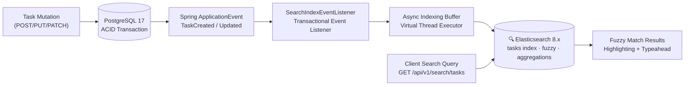
```mermaid
flowchart LR
    MUT["Task Mutation\n(POST/PUT/PATCH)"] --> PG[("PostgreSQL 17\nACID Transaction")]
    PG --> EVT["Spring ApplicationEvent\nTaskCreated / Updated"]
    EVT --> LISTENER["SearchIndexEventListener\nTransactional Event Listener"]
    LISTENER --> ES_QUEUE["Async Indexing Buffer\nVirtual Thread Executor"]
    ES_QUEUE --> ES[("🔍 Elasticsearch 8.x\ntasks index · fuzzy · aggregations")]

    CLIENT["Client Search Query\nGET /api/v1/search/tasks"] --> ES
    ES --> RESULTS["Fuzzy Match Results\nHighlighting + Typeahead"]
```

---

## 7. Database Architecture & Entity-Relationship Schema

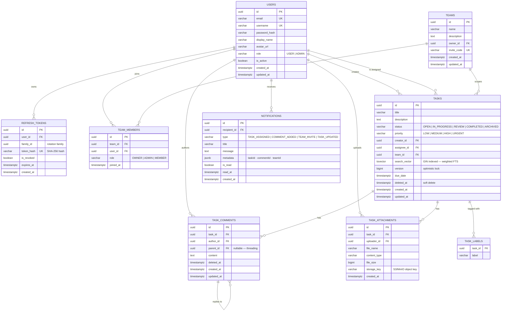
```mermaid
erDiagram
    USERS ||--o{ REFRESH_TOKENS   : "owns"
    USERS ||--o{ TEAM_MEMBERS     : "joins"
    USERS ||--o{ TASKS            : "creates"
    USERS ||--o{ TASKS            : "is assigned"
    USERS ||--o{ TASK_COMMENTS    : "authors"
    USERS ||--o{ TASK_ATTACHMENTS : "uploads"
    USERS ||--o{ NOTIFICATIONS    : "receives"

    TEAMS ||--o{ TEAM_MEMBERS     : "includes"
    TEAMS ||--o{ TASKS            : "scopes"

    TASKS ||--o{ TASK_COMMENTS    : "has"
    TASKS ||--o{ TASK_ATTACHMENTS : "has"
    TASKS ||--o{ TASK_LABELS      : "tagged with"

    TASK_COMMENTS ||--o{ TASK_COMMENTS : "replies to"

    USERS {
        uuid        id           PK
        varchar     email        UK
        varchar     username     UK
        varchar     password_hash
        varchar     display_name
        varchar     avatar_url
        varchar     role         "USER | ADMIN"
        boolean     is_active
        timestamptz created_at
        timestamptz updated_at
    }

    REFRESH_TOKENS {
        uuid        id           PK
        uuid        user_id      FK
        uuid        family_id    "rotation family"
        varchar     token_hash   UK  "SHA-256 hash"
        boolean     is_revoked
        timestamptz expires_at
        timestamptz created_at
    }

    TEAMS {
        uuid        id           PK
        varchar     name
        text        description
        uuid        owner_id     FK
        varchar     invite_code  UK
        timestamptz created_at
        timestamptz updated_at
    }

    TEAM_MEMBERS {
        uuid        id           PK
        uuid        team_id      FK
        uuid        user_id      FK
        varchar     role         "OWNER | ADMIN | MEMBER"
        timestamptz joined_at
    }

    TASKS {
        uuid        id           PK
        varchar     title
        text        description
        varchar     status       "OPEN | IN_PROGRESS | REVIEW | COMPLETED | ARCHIVED"
        varchar     priority     "LOW | MEDIUM | HIGH | URGENT"
        uuid        creator_id   FK
        uuid        assignee_id  FK
        uuid        team_id      FK
        tsvector    search_vector "GIN indexed — weighted FTS"
        bigint      version      "optimistic lock"
        timestamptz due_date
        timestamptz deleted_at   "soft delete"
        timestamptz created_at
        timestamptz updated_at
    }

    TASK_LABELS {
        uuid        task_id      FK
        varchar     label
    }

    TASK_COMMENTS {
        uuid        id           PK
        uuid        task_id      FK
        uuid        author_id    FK
        uuid        parent_id    FK  "nullable — threading"
        text        content
        timestamptz deleted_at
        timestamptz created_at
        timestamptz updated_at
    }

    TASK_ATTACHMENTS {
        uuid        id           PK
        uuid        task_id      FK
        uuid        uploader_id  FK
        varchar     file_name
        varchar     content_type
        bigint      file_size
        varchar     storage_key  "S3/MinIO object key"
        timestamptz created_at
    }

    NOTIFICATIONS {
        uuid        id           PK
        uuid        recipient_id FK
        varchar     type         "TASK_ASSIGNED | COMMENT_ADDED | TEAM_INVITE | TASK_UPDATED"
        varchar     title
        text        message
        jsonb       metadata     "taskId · commentId · teamId"
        boolean     is_read
        timestamptz read_at
        timestamptz created_at
    }
```

### High-Performance Indexing Strategy

| Index | SQL Definition | Purpose |
|:---|:---|:---|
| **Full-Text Search (GIN)** | `CREATE INDEX idx_tasks_fts ON tasks USING GIN (search_vector)` | Sub-millisecond full-text search on title + description |
| **Active Task Query** | `CREATE INDEX idx_tasks_team_active ON tasks (team_id, status) WHERE deleted_at IS NULL` | Team dashboard queries — partial index avoids deleted rows |
| **Unread Notifications** | `CREATE INDEX idx_notif_unread ON notifications (recipient_id) WHERE is_read = FALSE` | Unread badge count — partial index, extremely fast |
| **Comment Thread** | `CREATE INDEX idx_comments_thread ON task_comments (task_id, parent_id) WHERE deleted_at IS NULL` | Threaded comment tree reconstruction |
| **Token Lookup** | `CREATE INDEX idx_refresh_token_hash ON refresh_tokens (token_hash)` | O(log n) token verification on every `/auth/refresh` |

---

## 8. High-Performance Data & Storage Tier Lifecycle

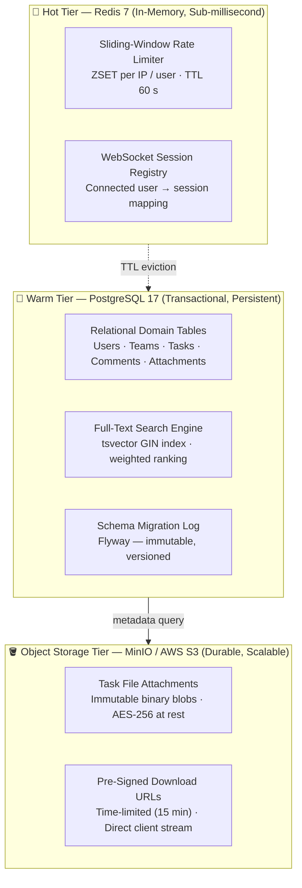
```mermaid
flowchart TB
    subgraph HOT["🔴  Hot Tier — Redis 7  (In-Memory, Sub-millisecond)"]
        direction LR
        RL["Sliding-Window Rate Limiter\nZSET per IP / user · TTL 60 s"]
        WS["WebSocket Session Registry\nConnected user → session mapping"]
    end

    subgraph WARM["🐘  Warm Tier — PostgreSQL 17  (Transactional, Persistent)"]
        direction LR
        REL["Relational Domain Tables\nUsers · Teams · Tasks · Comments · Attachments"]
        FTS["Full-Text Search Engine\ntsvector GIN index · weighted ranking"]
        MIG["Schema Migration Log\nFlyway — immutable, versioned"]
    end

    subgraph COLD["🪣  Object Storage Tier — MinIO / AWS S3  (Durable, Scalable)"]
        direction LR
        BLOB["Task File Attachments\nImmutable binary blobs · AES-256 at rest"]
        PS["Pre-Signed Download URLs\nTime-limited (15 min) · Direct client stream"]
    end

    HOT  -. "TTL eviction"  .-> WARM
    WARM -- "metadata query" --> COLD
```

---

## 9. Observability, Metrics & Telemetry Pipeline

TaskMaster implements enterprise-grade observability following the **OpenTelemetry** and **Prometheus** standards. Every request carries a correlation ID through the full call stack, enabling end-to-end distributed tracing.

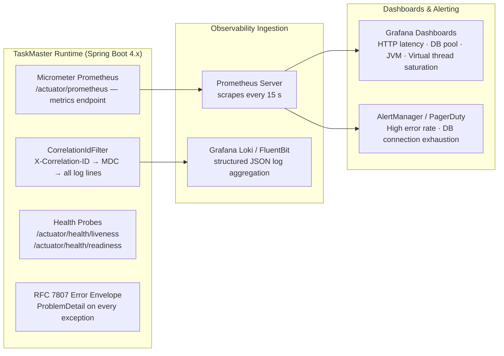
```mermaid
flowchart LR
    subgraph APP["TaskMaster Runtime  (Spring Boot 4.x)"]
        direction TB
        CID["CorrelationIdFilter\nX-Correlation-ID → MDC → all log lines"]
        PROM["Micrometer Prometheus\n/actuator/prometheus — metrics endpoint"]
        HEALTH["Health Probes\n/actuator/health/liveness\n/actuator/health/readiness"]
        ERR["RFC 7807 Error Envelope\nProblemDetail on every exception"]
    end

    subgraph COLLECT["Observability Ingestion"]
        direction TB
        PromSrv["Prometheus Server\nscrapes every 15 s"]
        Loki["Grafana Loki / FluentBit\nstructured JSON log aggregation"]
    end

    subgraph DASH["Dashboards & Alerting"]
        direction TB
        Grafana["Grafana Dashboards\nHTTP latency · DB pool · JVM · Virtual thread saturation"]
        Alerts["AlertManager / PagerDuty\nHigh error rate · DB connection exhaustion"]
    end

    PROM   --> PromSrv
    CID    --> Loki
    PromSrv --> Grafana
    PromSrv --> Alerts
```

---

## 10. Cloud-Native Deployment & Container Topology

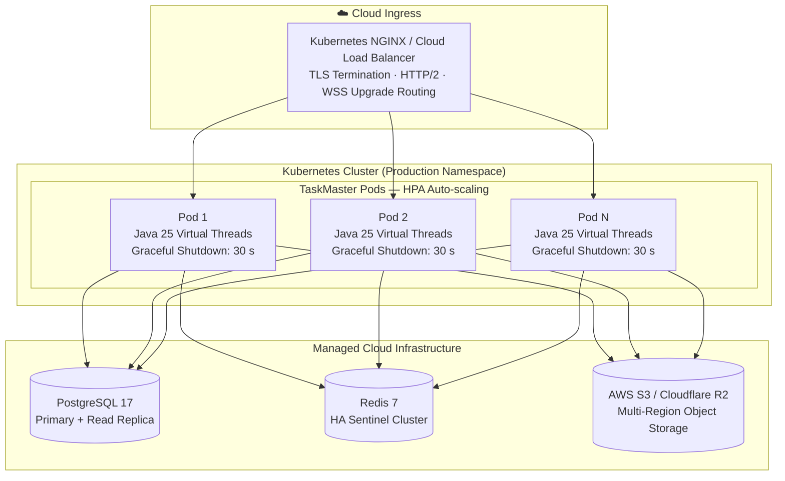
```mermaid
flowchart TB
    subgraph INGRESS["☁️  Cloud Ingress"]
        LB["Kubernetes NGINX / Cloud Load Balancer\nTLS Termination · HTTP/2 · WSS Upgrade Routing"]
    end

    subgraph K8S["Kubernetes Cluster  (Production Namespace)"]
        subgraph HPA["TaskMaster Pods  — HPA Auto-scaling"]
            P1["Pod 1\nJava 25 Virtual Threads\nGraceful Shutdown: 30 s"]
            P2["Pod 2\nJava 25 Virtual Threads\nGraceful Shutdown: 30 s"]
            PN["Pod N\nJava 25 Virtual Threads\nGraceful Shutdown: 30 s"]
        end
    end

    subgraph MANAGED["Managed Cloud Infrastructure"]
        direction LR
        PG[("PostgreSQL 17\nPrimary + Read Replica")]
        RD[("Redis 7\nHA Sentinel Cluster")]
        OBJ[("AWS S3 / Cloudflare R2\nMulti-Region Object Storage")]
    end

    LB --> P1
    LB --> P2
    LB --> PN

    P1 --> PG
    P2 --> PG
    PN --> PG

    P1 --> RD
    P2 --> RD
    PN --> RD

    P1 --> OBJ
    P2 --> OBJ
    PN --> OBJ
```

### Multi-Platform Deployment Targets

| Deployment Target | Orchestration / Artifacts | Environment Profiles & Ingress |
|:---|:---|:---|
| **Local / Self-Hosting** | `docker-compose.yml` (PostgreSQL 17, Redis, RabbitMQ, MinIO, Jaeger, Elasticsearch) | `dev` profile (`application-dev.yml`), localhost port mapping |
| **Modern PaaS (Railway / Render)** | `railway.json` / `render.yaml` with dynamic `PORT` injection & managed addon DBs | `prod` profile (`application-prod.yml`), dynamic SSL DB connection strings |
| **Kubernetes (K8s)** | Multi-stage Distroless Java 25 Image, `k8s/` manifests (Deployment, Service, Ingress, HPA) | `prod` profile, Kubernetes Liveness/Readiness probes (`/actuator/health/*`) |
| **Cloud (AWS/GCP/Azure/OCI)** | AWS ECS Fargate / GCP Cloud Run / Azure Container Apps / OCI Ampere A1 Compute | Cloud-managed Aurora/RDS, ElastiCache, S3, and OTLP OpenTelemetry exporters |

For detailed architectural trade-offs and design rationale, see [ADR 0008: Multi-Platform Cloud, PaaS & Container Deployment Strategy](./adr/0008-multi-platform-cloud-paas-deployment-strategy.md).

### 10.1 Distributed Resilience & Rate Limiting Engine (Phase 8)

Phase 8 elevates platform stability under extreme load via distributed coordination:
- **Distributed Redis Rate Limiting**: Atomic sliding-window rate limiting executed via Redis Lua scripts, eliminating race conditions across multiple application replicas.
- **Resilience4j Circuit Breakers & Timeouts**: Outbound dependencies (LLM APIs, S3 object storage, notification brokers) are protected with configurable failure thresholds (e.g. 50% failure rate over 10 calls trips circuit to `OPEN`).
- **Idempotency Key Engine**: Mutation requests enforce `Idempotency-Key` headers backed by SHA-256 payload digests to eliminate duplicate state transitions on network retries.

### 10.2 DAG Task Dependency & Workflow Automation Engine (Phase 10)

Phase 10 introduces workflow automation and dependency graphs:
- **Directed Acyclic Graph (DAG) Engine**: Tasks can declare blocking dependencies (`dependsOnTaskId`). Transitions to `IN_PROGRESS` or `COMPLETED` enforce that prerequisite tasks are completed. Cycle detection is validated at creation time using **Kahn's Algorithm** (topological sort).
- **Recurring Task Automation**: Scheduled cron triggers automatically generate task instances with dynamic date offsets and assignment rules.

### 10.3 Modern Collaborative Web Application Architecture (Phase 11)

Phase 11 delivers a progressive single-page web application engineered with **Next.js 15 (App Router)** and **React 19**:

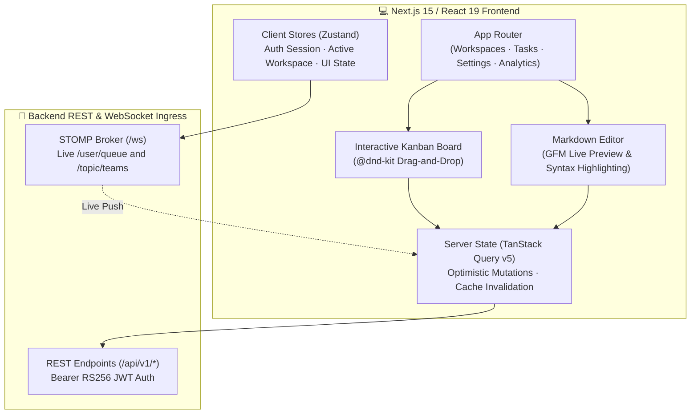
```mermaid
flowchart TB
    subgraph UI["💻 Next.js 15 / React 19 Frontend"]
        direction TB
        ROUTER["App Router\n(Workspaces · Tasks · Settings · Analytics)"]
        KANBAN["Interactive Kanban Board\n(@dnd-kit Drag-and-Drop)"]
        EDITOR["Markdown Editor\n(GFM Live Preview & Syntax Highlighting)"]
        STORES["Client Stores (Zustand)\nAuth Session · Active Workspace · UI State"]
        QUERY["Server State (TanStack Query v5)\nOptimistic Mutations · Cache Invalidation"]
    end

    subgraph API_GATE["🔐 Backend REST & WebSocket Ingress"]
        REST_EP["REST Endpoints (/api/v1/*)\nBearer RS256 JWT Auth"]
        WS_EP["STOMP Broker (/ws)\nLive /user/queue and /topic/teams"]
    end

    ROUTER --> KANBAN
    ROUTER --> EDITOR
    KANBAN --> QUERY
    EDITOR --> QUERY
    QUERY --> REST_EP
    STORES --> WS_EP
    WS_EP -. "Live Push" .-> QUERY
```

---

## 11. Technology Baseline Matrix

| Tier | Component | Selection | Architectural Rationale |
|:---|:---|:---|:---|
| **Runtime** | Language | **Java 25 (LTS)** | Virtual Threads (Project Loom), Records, Sealed Types, Pattern Matching. |
| **Framework** | Application Engine | **Spring Boot 4.x / Spring 7.0** | Jakarta EE 11 baseline, centralized BOM, RFC 7807 `ProblemDetail`. |
| **Security** | Auth & Signing | **Spring Security + Nimbus JOSE** | Asymmetric RS256 JWT, Public RFC 7517 JWKS endpoint, family-based replay mitigation. |
| **Database** | Relational Datastore | **PostgreSQL 17** | ACID transactions, Flyway migrations, `tsvector` GIN full-text search, JSONB. |
| **In-Memory** | Cache & Rate Limiter | **Redis 7 (Lettuce Client)** | Atomic ZSET sliding-window rate limiting, WebSocket session registry. |
| **Storage** | Object Storage | **MinIO / AWS S3 (AWS SDK v2)** | Direct pre-signed URL upload/download — zero app-server I/O bottleneck. |
| **Real-time** | Push Broker | **WebSocket + STOMP (SockJS)** | JWT-authenticated sessions, `convertAndSendToUser` point-to-point routing. |
| **AI Assistant** | Generative AI | **Universal OpenAI-Compatible Client** | Single `/chat/completions` adapter supporting Groq, Gemini, Ollama, AI Gateways. |
| **Observability** | Telemetry & Tracing | **OpenTelemetry (OTel) + OTLP** | CNCF standard vendor-neutral distributed tracing, W3C TraceContext, and Micrometer bridge. |
| **Mapping** | Object Mapping | **MapStruct 1.6** | Compile-time type-safe DTO ↔ Entity mapping — zero reflection overhead. |
| **API Docs** | Specification | **SpringDoc OpenAPI 3.1** | Auto-generated, always-in-sync Swagger UI at `/swagger-ui.html` + `docs/api/openapi.yaml`. |
| **Quality** | Testing & Verification | **ArchUnit + Testcontainers + Checkstyle** | Compile-time hexagonal boundary enforcement + containerised integration test slices. |
